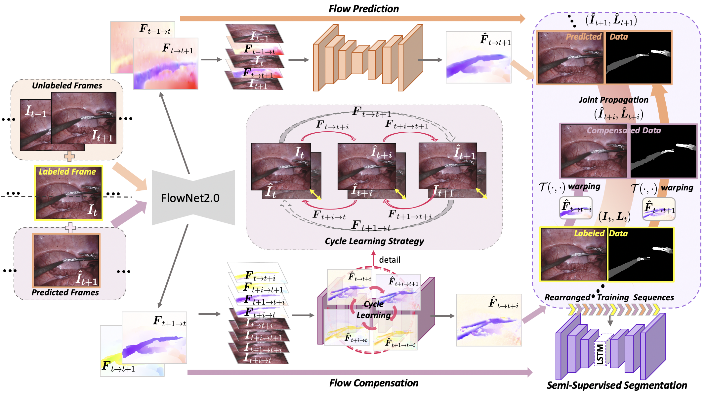

# Learning Motion Flows for Semi-supervised Instrument Segmentation from Surgical Robotic Videos
by [Zixu Zhao](https://scholar.google.com.hk/citations?user=GSQY0CEAAAAJ&hl=zh-CN),[Yueming Jin](https://yuemingjin.github.io/), [Xiaojie Gao](https://www.researchgate.net/profile/Xiaojie_Gao3), [Qi Dou](http://www.cse.cuhk.edu.hk/~qdou/), [Pheng-Ann Heng](http://www.cse.cuhk.edu.hk/~pheng/). 

### Introduction
* The Pytorch implementation for our MICCAI 2020 paper '[Learning Motion Flows for Semi-supervised Instrument Segmentation from Surgical Robotic Videos](https://arxiv.org/pdf/2007.02501.pdf)'. 

<p align="center">
  
</p>

* The Code contains two parts: motion learning (flow prediction and flow compensation) and semi-supervised segmentation.

### Data Preparation
* We use the dataset from [MICCAI 2017 Endoscopic vision challenge](https://endovissub2017-roboticinstrumentsegmentation.grand-challenge.org/).

* Please follow the data preprocessing steps in this [repository](https://github.com/keyuncheng/MF-TAPNet).

* The structure of data folder is arranged as follows:
```
(root folder)
├── data
|  ├── cropped_train
|  |  ├── instrument_dataset_1
|  |  |  ├── images
|  |  |  ├── binary_masks
|  |  |  ├── parts_masks
|  |  |  ├── instrument_masks
|  |  ├── instrument_dataset_2
|  |  |  ├── images
|  |  |  ├── binary_masks
|  |  |  ├── parts_masks
|  |  |  ├── instrument_masks
|  |  ├── ......

```


### Setup & Usage for the Code

1. Check dependencies:
```
- Python 3.6
- pytorch 0.4.1+
- pytorch-ignite 0.2.0+
- tensorboardX
- albumentations
- opencv-python
- cupy (please check your CUDA version before install)
- tqdm
```
2. Flow prediction & Flow compensation (./motion_learning/):
* To train the flow prediction model, run ``$ python train_mp.py``.
* To train the flow compensation model, run ``$ python train_mc.py``.
* Arguments for model training in ``$ bash train.sh`` are in default settings.
* To propagate frame-label pairs, run ``$ bash propagate.sh``.

3. Semi-supervised segmentation (./semi-seg/):
```
$ bash train.sh
```
Note: You may try other models from /Models/plane_model.py

### Citation
If this repository is useful for your research, please cite:
```
@inproceedings{zhao2020learning,
  title={Learning Motion Flows for Semi-supervised Instrument Segmentation from Robotic Surgical Video},
  author={Zhao, Zixu and Jin, Yueming and Gao, Xiaojie and Dou, Qi and Heng, Pheng-Ann},
  booktitle={International Conference on Medical Image Computing and Computer-Assisted Intervention},
  pages={679--689},
  year={2020},
  organization={Springer}
}
```

### Questions

For further question about the code or paper, please contact 'zxzhao@cse.cuhk.edu.hk'
